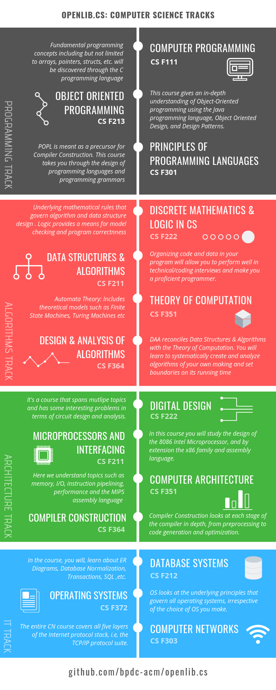

# OpenLib.cs

OpenLib.cs is a collaborative effort to make textbooks, solution manuals and other resources freely available for students who are currently pursuing the following courses (or their equivalents) at university. 

## Course Navigation

### 1st Year Courses

*   [Computer Programming](./courses/CSF111)

### 2nd Year Courses

*   [Data Structures & Algorithms](./courses/CSF211)
*   [Database Systems](./courses/CSF212)
*   [Object Oriented Programming](./courses/CSF213)
*   [Logic in Computer Science](./courses/CSF214)
*   [Digital Design](./courses/CSF215)
*   [Discrete Structures for Computer Science](./courses/CSF222)
*   [Microprocessors & Interfacing](./courses/CSF241)

### 3rd Year Courses

*   [Principles of Programming Languages](./courses/CSF301)
*   [Computer Networks](./courses/CSF303)
*   [Computer Architecture](./courses/CSF342)
*   [Theory of Computation](./courses/CSF351)
*   [Compiler Construction](./courses/CSF363)
*   [Design & Analysis of Algorithms](./courses/CSF364)
*   [Operating Systems](./courses/CSF372)

### Electives

*  [Cryptography](./courses/CSF463)
*  [Service Oriented Computing](./courses/CSF466)
*  [Artificial Intelligence](./courses/CSF)
*  [Data Mining](./courses/CSF)

## Usage

*   A directory is maintained for each course within which is a README that provides information regarding the course. The README may have the following sections if applicable :
    *   **Prerequisites** - Courses that need to be completed prior to attempting the particular course
    *   **Textbooks** - List of textbooks with links to their soft copies
    *   **Code** - Implementation of course concepts
    *   **Videos** - List of links of video explanations of course concepts
    *   **Websites** - Useful websites
    *   **Articles** - Cheat-sheets, tutorials, blog-posts etc.
    *   **Communities** - Online forums related to the course concepts
    *   **Apps** - Mobile apps that may enrich the learning experience
*   There are also [scripts](./scripts) that provide certain useful features (WIP)

## Guidelines

*   This repository provides links to the required study material such as **textbooks**, **solution manuals** and **reference books**.
*   Copies of the study material can be borrowed from the library while appearing for **open-book exams**. Moreover, printouts of the same can also be taken into the exam hall if required. Written notes are also allowed.

## Tracks

## Communities

*   [r/AskComputerScience](https://www.reddit.com/r/AskComputerScience/)
*   [r/compsci](https://www.reddit.com/r/compsci/)
*   [r/Programming](https://www.reddit.com/r/programming/)
*   [GeeksforGeeks](https://www.geeksforgeeks.org/)
*   [Computerphile](https://www.youtube.com/channel/UC9-y-6csu5WGm29I7JiwpnA)
*   [Code.org](https://www.youtube.com/channel/UCJyEBMU1xVP2be1-AoGS1BA)
*   [Brilliant](https://brilliant.org/computer-science/) 

## Videos

*   [Crash Course Computer Science, *Crash Course*](https://www.youtube.com/playlist?list=PL8dPuuaLjXtNlUrzyH5r6jN9ulIgZBpdo)
*   [Map of Computer Science, *Domain of Science*](https://www.youtube.com/watch?v=SzJ46YA_RaA)

## Competitive Programming

This section is not part of the coursework, however if you are interested in algorithms, then try out practice problems and participate in programming tournaments in the following sites.

* [Hackerrank](https://www.hackerrank.com/dashboard)
* [CodeForces](https://codeforces.com/)
* [CodeChef](https://www.codechef.com/)
* [HackerEarth](https://www.hackerearth.com/practice/)
* [LeetCode](https://leetcode.com/)
* [topcoder](https://www.topcoder.com/)
* [Daily Coding Problem](https://www.dailycodingproblem.com/)
* [Project Euler](https://projecteuler.net/archives)
* [Sphere Online Judge](https://www.spoj.com/)
* [A² Online Judge](https://a2oj.com/)
* [Coding Ninjas](https://www.codingninjas.in/)
* [Coding Blocks](https://codingblocks.com/)
